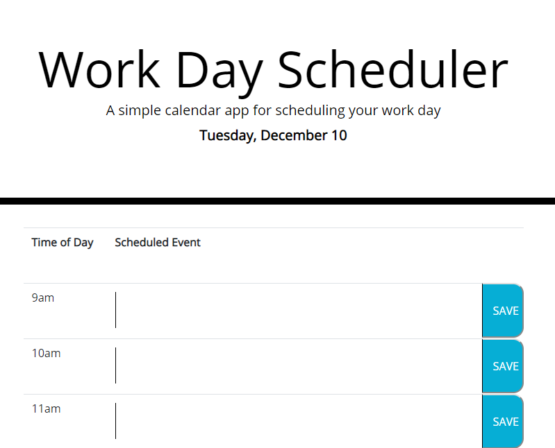

# HW5-Day-Planner
This repository is for our fifth homework assignment, the Day Planner

## Description
This application is a simple day planner desingned to help schedule events throughout the workday. It saves events to the browser, displays the current day, and shows the current hour by dynamically changing the background of each timeblock.

## How it Works
Using local storage, our user is able to save upcoming events to this day-planner. This data can be retreived across browser sessions, and will track their progression through the day.

## Under the Hood
Below are two code snippets that demonstrate different aspects of the application's inner workings.

### code snippet 1

This segment of code serves to generate the timeslots dynamically using JavaScript and jQuery.

    function buildTable() {
      var schedule;
        schedule = $("<table>");
        schedule.addClass("table")
      $("#time-slots").append(schedule);
      var tableHeaders;
        tableHeaders = $("<tr>");
        tableHeaders.addClass("row");
      schedule.append(tableHeaders);
      var toDay;
        toDay = $("<th>");
        toDay.addClass("col-2");
        toDay.text("Time of Day");
      tableHeaders.append(toDay);
      var eventHead;
        eventHead = $("<th>");
        eventHead.addClass("col-10");
        eventHead.text("Scheduled Event");
      tableHeaders.append(eventHead);
      renderTimeSlots();
    };
    buildTable();

This funciton, buildTable, generates DOM elements by creating new variables, defining them as new elements in the HTML, then adding attributes to those elements. This allows us to add classes rapidly to several HTML elements at once, which can then be refered to when designing interactivity with the page, without having to hard code each and every event listener.

### code snippet 2

## The App In Action!

### screenshot 1

At the top of our webpage we see the title of the application, and below it today's date. This display is provided to the user by getting data from the window object used by the browser. Through defining variables and arrays, the function at work converts the date from the window object to an easily readable combination of the day of the week, followed by the month, and then the date.

### screenshot 2

## Deployed Link
Below is a link to the live application!
* [See Live Site](https://ietoy.github.io/HW5-Day-Planner/) 

## Authors
Ian Toy

## Acknowledgements
Special thanks to my instructor Jerome, our teaching assistants Kerwin and Mahisha, my tutor Crystal, and my classmates Yali, Chris, Rachel, Ken, and Andres for their help in making this application possible!

